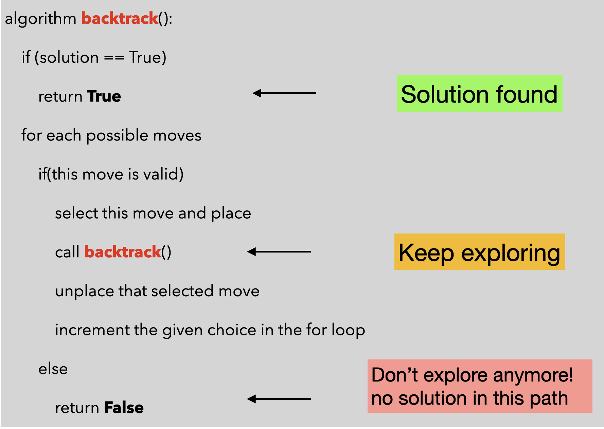
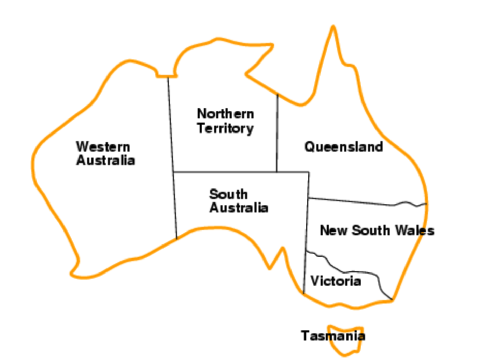

# Sessió en línia del dia 7/12/2020: Enumeratius / Backtracking

Un algoritme enumeratiu és aquell que garanteix l'obtenció de la millor solució, l'òptim, per la via d'explorar tot l'espai de les solucions possibles. La sortida del mètode consisteix en enumerar totes les solucions òptimes.

Tenim diverses tècniques per tal de trobar aquestes solucions:


* **El backtraking**: El backtracking és una tècnica algorítmica que ens permet resoldre problemes de forma recursiva, intentant construir una solució de manera incremental, eliminant totes aquelles solucions parcial, (retrocedint/backtrack) que no compleixen les limitacions del problema, tan aviat com es determina que la solució no es pot completar com a solució vàlida/òptima.  Malauradament, un algorisme de backtracking pot passar molt de temps explorant parts de l’espai de possibles solucions que no donen lloc a una solució vàlida i/o òptima.

* **Ramificació i poda (Branch and Bound)**: Un procediment enumeratiu basant en ramificació i poda requereix definir una funció d'avaluació per a cada node, per així seleccionar en cada pas quin és el millor node a explorar, i per altra banda eliminar certs nodes a ser explorats (aquells que no arribaran a la solució òptima). L'eficiència del mètode anirà fortament lligat a la funció que avalua cada node.


--- 
## Backtracking

Pensem amb el problema de la motxilla mitjançant la tècnica del backtracking.


Fins ara hem resolt aquest problema amb diverses solucions: 
* Força bruta
* Greedy
* Programació dinàmica

Si tinguéssim els següents 5 objectes:

|          | Weight | Weight |
|----------|--------|--------|
| Object 1 | 2      | 40€    |
| Object 2 | 3.14   | 50€    |
| Object 3 | 1.98   | 100€   |
| Object 4 | 5      | 95€    |
| Object 5 | 3      | 30€    |

Amb la força bruta hauríem d'explorar totes les possibles solucions i avaluar-les així com és mostra a la següent imatge.


Podem optimitzar la solució aconseguida mitjançant el Backtracking. Com hem dit abans, el backtracking és una estratègia recursiva que crearà la solició de forma incremental explorant totes les possibles solucions però descartant aquelles que no puguin arribar a una solució òptima donat unes restriccións i objectiu definit. En el cas del problema de la motxila, podem utilitzar el DFS per tal d'explorar l'arbre de solucions. Si arribem a una solució parcial on la solució ja no és factible, no cal continuar explorant. En l'exemple donat, el retrocés seria molt més eficaç si tinguéssim encara més articles o una capacitat de motxilla menor.
Pensem primer una solució amb backtracking.

Amb backtracking tenim tres punts importants:
* Les eleccions
* Les restriccions 
* L'objectiu

En el cas del problema de la motxilla. Ens queda d'aquesta manera:
* Les eleccions: Incloure o no incloure l'objecte
* Les restriccions: No pot superar un cert pes
* L'objectiu: Els objectes seleccionats han de tenir el màxim valor


A continuació podem veure el codi python pel problema de la motxilla mitjançant backtracking:

```python

# max amount of weight allowed
max_weight = 23

# actual items
item_values = [16, 15, 4, 3, 2]
item_weights =[14, 13, 7, 2, 1]

# max no.of items available
num_items = len(item_weights)


def knapsack(current_weight=0, current_value = 0, index=0, items = []):
    
    # exit conditions
    if current_weight >= max_weight:
        return (current_value, current_weight,items)
    if index >= num_items:
        return (current_value, current_weight,items)
    
    # We have 2 cases (take/don't take)
    case1_value, case1_weight,case1_items = knapsack(current_weight + item_weights[index],
                                                     current_value + item_values[index], 
                                                     index + 1,items +[index])
    case2_value, case2_weight,case2_items = knapsack(current_weight, 
                                                     current_value, 
                                                     index + 1,items)
    return max([(v,w,items) for v,w,items in [(case1_value,case1_weight,case1_items),
                                              (case2_value,case2_weight,case2_items)] if w <= max_weight])
                                              
print(knapsack())                                           
```
--- 

### Vídeo Sudoku via Backtracking

<center>
<iframe width="560" height="315" src="https://www.youtube.com/embed/Zq4upTEaQyM" frameborder="0" allow="accelerometer; autoplay; clipboard-write; encrypted-media; gyroscope; picture-in-picture" allowfullscreen></iframe>
 </center>

---

### Esquema general d'un algoritme de backtracking
A continuació podem veure l'esquema general d'un algorítme de backtracking:



---

### Exercici: Pinta el mapa
Donat el següent mapa:





es demana trobar un algoritme que ens doni totes les possibles solucions que tenim si volem pintar el mapa utilitzant únicament 3 colors.

