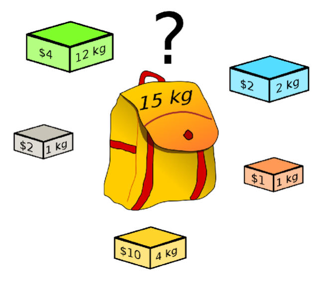
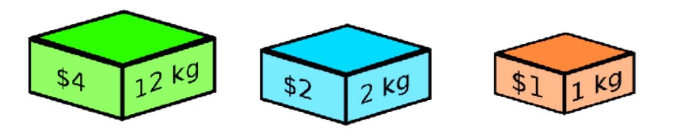
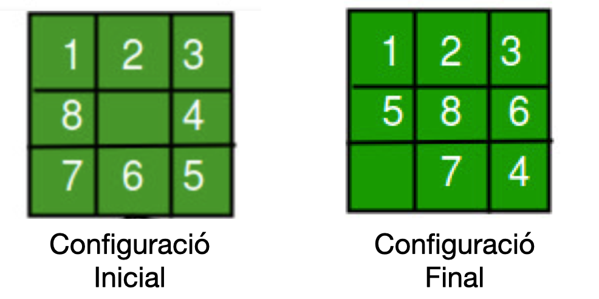
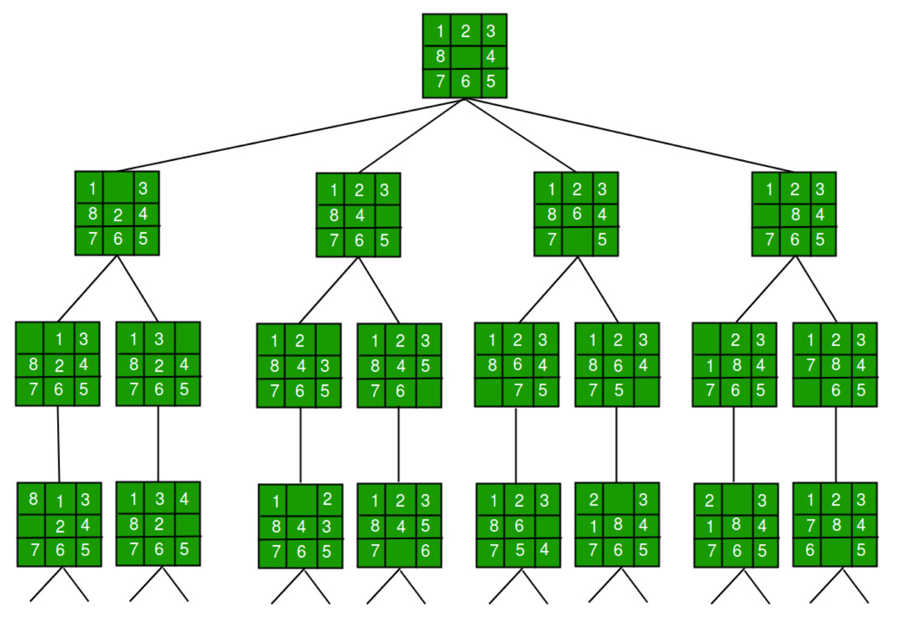
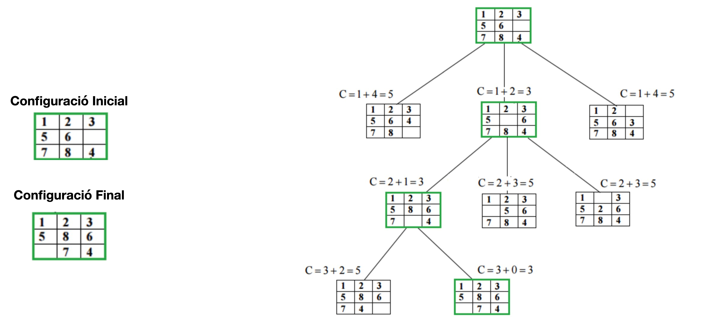

# Sessió en línia del dia 20/12/2020: Enumeratius / Ramificació i Poda

Els algoritmes de ramificació i poda (*branch and bound* en angles) implementen l'algoritme de backtracking, però no a la inversa. Els podem veure com una variant millorada del backtracking aplicada majoritariament a problemes optimiació combinatoria o matemàtica.

L'objectiu de la ramificació i poda consisteix amb reduïr l'espai de cerca, explorant primer aquelles solucions més prometedores i descartant durant el procés totes aquelles solucions parcials que no puguin produir una millor solució de l'obtinguda fins aleshores. Per a realizar això, s'introdueixen unes cotes que ens ajudaran a escollir la solució a explorar i rebjutar-ne d'altres. A diferència del backtracking, aquí no limitem l'exploració del graf a cap algoritme en particular. L'exploració del graf anirà regida en funció de les cotes obtingudes.

Un dels punts principals dels algoritmes de ramificació i poda és trobar i definir una funció que determinarà la cota inferior i/o superior al problema optimització que volem resoldre. Un cop definida la aquesta funció s'explora el node més prometedor en cada etapa i es rebutgen (poda) totes aquelles solucions quan la cota és inferior (superior en cas d'un problema de maximització) a una solució ja trobada o bé a la cota inferior (superior en cas d'un problema de maximització) d'un altre node.

Per a les cotes hem de guardar informació dels estats no explorats per retomar-les en el procés d'exploració. 
En problemes de **maximització**, la cota superior ens indica la solució màxima possible si seguim el node donat. 
En problemes de **minimització**, la cota inferior ens indica la solució mínima si seguim el node donat.

---

## Exercici: Problema de la motxilla 
La setmana passada vam veure com podíem resoldre el problema de la motxilla mitjançant un algoritme de backtracking. Aquesta setmana veiem com podem encara millorar
la solució d'aquest problema mitjançant un algoritme de ramificació i poda.

Ho podem fer millor (que amb el backtracking) si coneixem una cota que ens indica quina és la millor possible solució que trobarem en subarbre de cada node del graf. Si la cota d'un node en questió és menor que una solució ja trobada, podem ignorar (podar) aquest node i tots els seus subarbre. Per tant, l'estratègia consisteix a calcular la cota superior (millor solució) per a cada node i comparem aquesta cota amb la millor solució trobada fins aleshores abans d'explorar el node.

Donat els següents objectes i una capacitat màxima de 15 Kg:

Veiem pas a pas com podem fer-ho.

El primer que hem de fer és definir com calcularem la cota inferior i la cota superior. Les podem calcular de la següent manera:
* **Cota superior**: Agafem tots els objectes que **individualment** càpiguen dins la motxilla. En el nostre cas, donat que la motxilla té una capacitat màxima de 15kg, podrem considerar tots els objectes que individualment pesin menys de 15kg. Per tant, en el nostre exemple, la cota superior inicial equival a 4+2+10+2+1 = 17$.
* **Cota inferior**: Agafem els primers objectes de la llista fins a arribar a la capacitat màxima de la motxilla. En el nostre exemple, la cota inferior inicial equival a 4+2+2 = 8$.

A continuació podem començar:

* Primer pas: Trobem la cota inferior mitjançant una solució qualsevol. Com hem dit abans aquesta tindrà un valor de 8$. 
  

 
 
Segon pas: Agafem un primer objecte, en aquest cas l'objecte de color verd amb un valor de $4 i pes de 12kg. Calculem la cota superior i inferior de les dues opcions (agafar i no agafar l'objecte).
    * La cota superior ens dóna el màxim resultat que podríem arribar a obtenir si considerem agafar aquest objecte.
        * Si agafem l'objecte verd:
            * **Cota superior**: 4$ + el valor de la resta d'objectes que **individualment** càpiguen dins la motxilla (4+2+2+1). Com podem veure, l'objecte groc no es considerat ja que la capacitat restant de la motxilla és 3kg i l'objecte groc pesa 4 kg. Cota Superior: 13$
            * **Cota inferior**: 4$ + el valor dels objectes següents fins arribar a la capacitat màxima. Cota Inferior: 4 + 2 +2 = 8$
        * Si NO agafem l'objecte verd:
            * **Cota superior**: El valor de la resta d'objectes que **individualment** càpiguen dins la motxilla (2+10+2+1). Cota Superior: 15$
            * **Cota inferior**: El valor dels objectes següents fins arribar a la capacitat màxima. Cota Inferior: 2 + 10 +2 +1 = 15$

* Tercer pas: Decidim quin node explorar tenint en compte la cota inferior i la cota superior de tots els nodes actius. En el nostre cas només tenim 2 nodes actius. En aquest cas explorarem el node corresponent a no agafar l'objecte verd, ja que la seva cota inferior supera la cota superior de l'altre node.

* Quart pas: Explorem el node seleccionat i avaluem la cota de inferior i superior dels seus fills. Si la cota superior dels fills és superior a la cota inferior actual, els afegim a la llista de nodes actius. En cas contrari, no afegim el node i per tant podem l'arbre de solucions.
* Quint pas: continuem fins a trobar la solució òptima.
---

## Exercici: Assignació de tasques:
Tenim 4 tasques i 4 empreses disponibles. Cada empresa ens ha ofert una solució a cada una de les tasques amb un cost X. Volem assignar una única tasca diferent a cada empresa tal que el cost total sigui el mínim. El cost de les tasques per a cada una de les empreses ve definit segons la següent taula:

|           | Tasca A | Tasca B | Tasca C | Tasca D |
|-----------|---------|---------|---------|---------|
| Empresa 1 | 11      | 12      | 18      | 40      |
| Empresa 2 | 14      | 15      | 13      | 22      |
| Empresa 3 | 11      | 17      | 19      | 23      |
| Empresa 4 | 17      | 14      | 20      | 28      |

Trobeu la solució del problema mitjançant un algoritme de ramificació i poda.

---

## Exercici:  Puzzle 8
Donat un taulell de 3x3 amb 8 números i un espai buit. L’objectiu és col·locar els números a les cel·les perquè coincideixin amb la configuració final mitjançant l’espai buit. Podem lliscar les cel·les adjacents (dreta, esquerra, amunt i avall) de l’espai buit.
Exemple: 

Solució amb força bruta: Podem fer una cerca utilitzant el mètode DFS (Mirem de totes les configuracions d'un problema determinat, és a dir, tots els estats als quals es pot accedir des de l'estat inicial).

Aquesta solució té un problema donat que els moviments successius ens poden allunyar de l'objectiu en lloc d'apropar-nos. Pot ser que no es trobi mai una solució amb aquest enfocament.

### Solució amb ramificació i poda:
Penseu una solució mitjanaçant Ramificació i poda.

Estem en un problema de minimització, definirem una funció de cost que estimi la cota superior.
La funció de cost la podem definir de la següent manera:
* C(X) = g(X) + h(X) on:
    * g(X) és el cost d'arribar al node X des de l'arrel. És a dir, el número de moviments realitzats fins aleshores.
    * h(X) és el cost d'arribar a una solució desde el Node X. Podem estimar el número de moviments mínims que s'han de realizar mirant el número de posicions on tinguem un número i aquest sigui diferent del número objectiu de la solució.

Exemple:

Implementeu l'algorítme de ramificació i poda.

