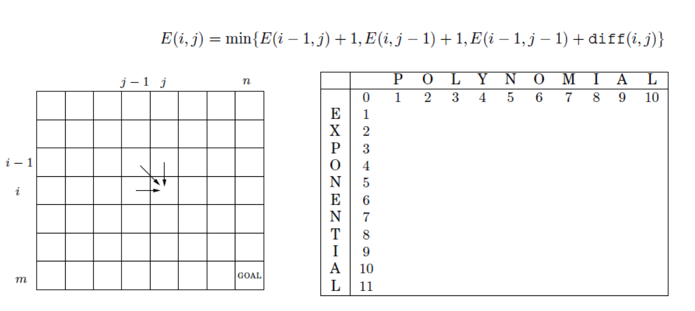
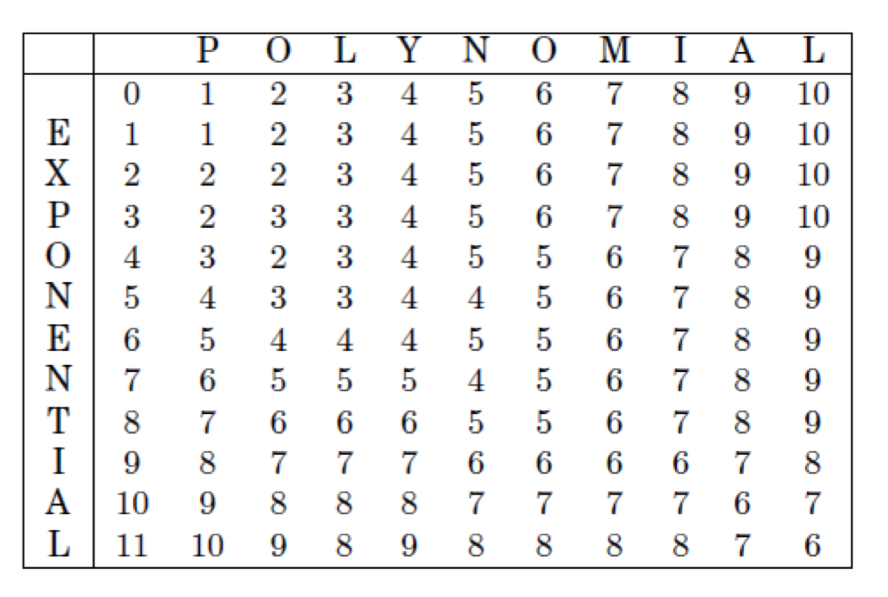
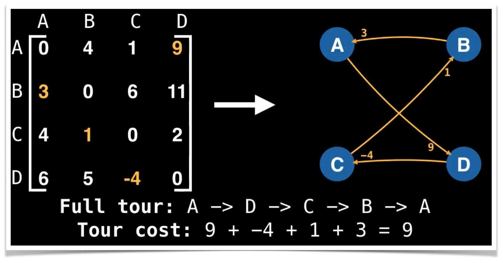
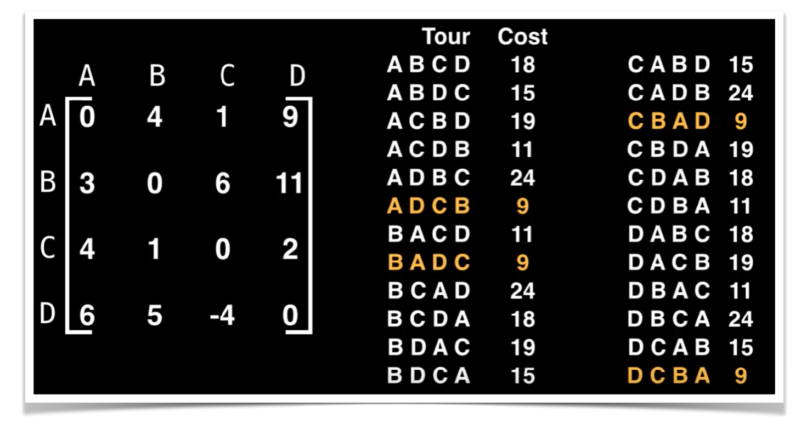

# Sessió en línia del dia 30/11/2020: Programació Dinàmica 2

### Exemple: Longest Increasing Subsequence (LIS)

El problema de la seqüència creixent màxima, consisteix amb trobar una subseqüència d'una seqüència donada, tal que els elements de la subseqüència estiguin ordenats, de menor a major, i la subseqüència sigui el més gran possible.
Per exemple:

* Donada la seqüència: 
    * 0, 8, 4, 12, 2, 10, 6, 14, 1, 9, 5, 13, 3, 11, 7, 15

* Una subseqüència creixent màxima pot ser:
   * 0, 2, 6, 9, 11 , 15

Aquesta subseqüència té longitud 6, i la seqüència d'entrada donada no té cap subseqüència creixent de tamany 7. La subseqüència anterior no és l'única de longitud 6, sinó que tindre diverses com per exemple:

* 0 ,4, 6, 9, 11, 15

La solució d'aquest problema amb programació dinàmica ve donat per la següent funció recurrent:

```L(i) = 1 + max(L_0,L_1,...,L_i-1)```

amb el cas base:

```L(0) = 0```

L'algoritme amb programació dinàmica per trobar aquesta solució pot ser el següent:

```python
def lis(A):
    L = [1] * len(A)
    for i in range(1, len(L)):
        subproblems = [L[k] for k in range(i) if A[k]<A[i]]
        L[i] = 1 + max(subproblems,default=0)
    return max(L,default=0)
```


Mireu el següent vídeo del minut 0.00 fins 9:20:
<center>
<iframe width="560" height="315" src="https://www.youtube.com/embed/aPQY__2H3tE" frameborder="0" allow="accelerometer; autoplay; clipboard-write; encrypted-media; gyroscope; picture-in-picture" allowfullscreen></iframe>
</center>

---

### Exemple: Distància d'edició (levenshtein)
Donades dues paraules per exemple: SNOWY and SUNNY quina és el distancia d'edició? 
* Tenim diferents accions: Inserció, Eliminació i Substitució.
* Cada acció té un cost, suposem que el cost de cada acció és igual a 1.
La distància consisteix en el nombre d'accions utilitzades per transformar una paraula p_1 a una paraula p_2
Sense dubtes hi ha moltes possibles solucions. Per exemple:
* S  -  S  (mantenim la S: Cost 0)
* _  -  U  (inserim la U: Cost 1)
* N  -  N  (mantenim la N: Cost 0)
* O  -  N  (substituïm la O per N: Cost: 1)
* W  -  _  (eliminem la W: Cost 1)
* Y  -  Y  (mantenim la Y: Cost 0)

Cost total = 3

Un altre exemple:
* _  -  S  (inserim la S: cost 1)
* S  -  U  (substituïm la S pr la U: Cost 1)
* N  -  N  (mantenim la N: Cost 0)
* O  -  _  (eliminem la O Cost 1)
* W  -  _  (eliminem la W: Cost: 1)
* _  -  N  (inserim la N: Cost 1)
* Y  -  Y  (mantenim Y: Cost 0)

Cost total = 5

Podem definir la seqüència recurrent tenint en compte els següents punts:
* Cost d'edició ```E(i,j)``` serà el mínim entre: 
* - ```E(i-1,j) +1``` -> eliminem una lletra
* - ```E(i,j-1) +1``` -> afegim una lletra
* - ```E(i-1],j-1) + diff(i,j)``` -> substituïm o mantenim.

<figure><center>
   
</center></figure>

El cost d'edició de la paraula (POL) per (EXP) vindrà definit per:
```E(POL,EXP) = min{E(PO,EXP) +  1, E(POL, EX) + 1, E(PO,EX) + dif(L,X)}```
Si executem aquesta funció recursiva d'esquerra a dreta i de dalt a sota, podem emplenar aquesta taula i obtindrem el següent resultat:
<center><figure>
   
</figure></center>


La solució naïf d'aquest problema podria ser la següent:
```python
def editDistance(str1, str2, m, n):
 
    # Si el primer string té longitud 0 , l'única opció
    # és afegir els caràcters del segon string
    if m == 0:
        return n
 
    # Si el segon string té longitud 0, l'única opció
    # és eliminar els caràcters del primer string
    if n == 0:
        return m
 
    # Si l'últim caràcter dels dos string és el mateix
    if str1[m-1] == str2[n-1]:
        return editDistance(str1, str2, m-1, n-1)
 
    # Si l'últim caràcter dels dos string no és el mateix
    # cridem la funció recusiva de les diferencs accions i agafem la de menor cost+1
    return 1 + min(editDistance(str1, str2, m, n-1),    # afegir
                   editDistance(str1, str2, m-1, n),    # eliminar
                   editDistance(str1, str2, m-1, n-1)   # reemplaçar
                   )
 
 
str1 = "sunny"
str2 = "snowy"
print editDistance(str1, str2, len(str1), len(str2))
```

La solució d'aquest problema amb programació dinàmica podria ser la següent:

```python
def editDistDP(str1, str2, m, n):
    # Creeam una taula per guardar els resultats
    dp = [[0]*(n + 1) for _ in range(m + 1)]
 
    for i in range(m + 1):
        for j in range(n + 1):
 
            # Si el primer string té longitud 0 , l'única opció
            # és afegir els caràcters del segon string
            if i == 0:
                dp[i][j] = j    
 
            # Si el segon string té longitud 0, l'única opció
            # és eliminar els caràcters del primer string
            elif j == 0:
                dp[i][j] = i    
 
            # Si l'últim caràcter dels dos string és el mateix
            elif str1[i-1] == str2[j-1]:
                dp[i][j] = dp[i-1][j-1]
 
            # Si l'últim caràcter dels dos string no és el mateix
            else:
                dp[i][j] = 1 + min(dp[i][j-1],        # Afegir
                                   dp[i-1][j],        # Eliminar
                                   dp[i-1][j-1])      # reemplaçar
 
    return dp[m][n]
 
 
str1 = "sunny"
str2 = "snowy"
print(editDistDP(str1, str2, len(str1), len(str2)))
```

---
### Exercici: 
Associar la paraula ALGORISMICA amb la paraula AVANÇADA fent ús d’aquesta inicialització i funció  de programació dinàmica

---
### Exemple: Viatjant de comerç
EL problema del viatjant de començ consisteix amb trobar un recorregut de longitud mínima per a un viatger que hagi de visitar diverses ciutats i després tornar al punt d’inici, on la distància existent entre cada parella de ciutats és coneguda.

És a dir, donat un graf dirigit amb arestes amb cost positiu, es vol trobar un **circuit de longitud mínima** que **comenci i acabi** en el **mateix node** passant exactament **un cop per a cada un dels nodes** restants.
<center><figure>
   
</figure></center>

Aquest problema consisteix amb trobar el **circuit Hamiltonià**.

Trobar la solució mitjançant una cerca exhaustiva implica mirar totes les possibles permutacions dels nodes ordenats, el que implica una complexitat de complexitat **O(n!)**.
<center>
   <figure>
   
</figure>
 </center>


Tenim una solució mitjançant programació dinàmica que millora significament la complexitat en el temps, passem d’una complexitat ```O(n!)```  a ```O(n^2 2^n)```

La idea principal consisteix en calcular la solució òptima per a tots els subcamins de longitud N utilitzant informació que ja coneixem de les solucions parcials òptimes amb longitud N-1


Abans de veure el vídeo intenteu pensar com podríeu solucionar el problema del viatjant de comerç mitjançat Programació Dinàmica.

PISTA: Si ```D(v_i, S)``` és la longitud del camí mínim sortint del vèrtex ```v_i``` i passant per cadascun dels vèrtexs del conjunt S i tornat al vèrtex ```v_i```. La funció de recurrència es pot definir com:

* ```g(i, {}) = {L_ij} si S = {}```
* ```g(i, S ) = Min_{j in S}  { L_ij  + g(j, S-{j})}```


<center>
   
  <iframe width="560" height="315" src="https://www.youtube.com/embed/cY4HiiFHO1o" frameborder="0" allow="accelerometer; autoplay; clipboard-write; encrypted-media; gyroscope; picture-in-picture" allowfullscreen></iframe>
 </center>


