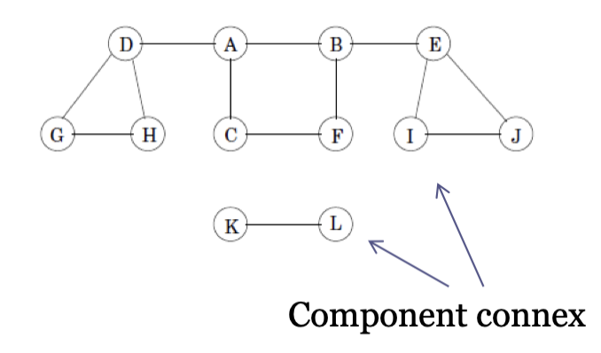

# Sessió en línia del dia 5/10/2020: Grafs I

Aquesta sessió té una durada aproximada de 60 minuts i està formada per alguns vídeos sobre els aspectes teòrics del tema i diversos exercicis. 
Es recomana seguir aquests continguts en el mateix ordre que apareixen en aquesta pàgina.


---

### Vídeo: Representació

Video de 14' amb una introducció als grafs i a la representació.


<center>
 <iframe width="560" height="315" src="https://www.youtube.com/embed/eQA-m22wjTQ" frameborder="0" allow="accelerometer; autoplay; clipboard-write; encrypted-media; gyroscope; picture-in-picture" allowfullscreen></iframe>
</center>
---

---
### Exercici 0: RECAP Recorregut Grafs
Donat el següent arbre:

```python
# Using a Python dictionary to act as an adjacency list
graph = {
    'A' : ['B','C'],
    'B' : ['D', 'E'],
    'C' : ['F'],
    'D' : [],
    'E' : ['G'],
    'F' : ['H'],
    'G' : [],
    'H' : []
}

visited = set() # Set to keep track of visited nodes.

def explore(visited, graph, node):
    if node not in visited:
        print (node)
        visited.add(node)
        for neighbour in graph[node]:
            explore(visited, graph, neighbour)

# Driver Code
explore(visited, graph, 'A')
```

Quina es la sortida del codi anterior? Què fa?


### Vídeo: DFS

Vídeo de 10' sobre l'algoritme DFS

<center>
<iframe width="560" height="315" src="https://www.youtube.com/embed/7fujbpJ0LB4" frameborder="0" allow="accelerometer; autoplay; encrypted-media; gyroscope; picture-in-picture" allowfullscreen></iframe>
</center>
 
---
### Exercici 1: DFS

Quina és la complexitat del DFS implementat mitjançant una **llista d'adjacència**?
Podeu veure el codi a sota.

```python
# Using a Python dictionary to act as an adjacency list
graph = {
    'A' : ['B','C'],
    'B' : ['D', 'E'],
    'C' : ['F'],
    'D' : [],
    'E' : ['F'],
    'F' : []
}

visited = set() # Set to keep track of visited nodes.

def dfs(visited, graph, node):
    if node not in visited:
        print (node)
        visited.add(node)
        for neighbour in graph[node]:
            dfs(visited, graph, neighbour)

# Driver Code
dfs(visited, graph, 'A')
```
---
### Exercici 2: DFS
+ Modifiqueu el codi anterior utilitzant la matriu d'adjacència.
+ Quina és la complexitat del DFS utilitzant la matriu d'adjacència?

---

### Video: BFS

Vídeo de 8' sobre l'algoritme BFS

<center>
<iframe width="560" height="315" src="https://www.youtube.com/embed/oDqjPvD54Ss" frameborder="0" allow="accelerometer; autoplay; encrypted-media; gyroscope; picture-in-picture" allowfullscreen></iframe>
</center>

---

### Exercici 3: BFS
Considerem un Arbre format per N nodes i N-1 arestes on cada node rep un nombre del 1 a N com a identificador únic. Sigui l'1 el node arrel de l'arbre situat nivell 1, fes un programa que, donat un nivell $x$, retorni el nombre de nodes que es trobin en aquest nivell. 

**Format de entrada:**

+ La primera línia consisteix en un únic enter N que indica el nombre de nodes de l'arbre. Cadascuna de les següents n-1 línies consta de 2 enters a i b que denoten una aresta no dirigida entre el node a i el node b. La següent línia consisteix en un únic enter x.

**Format de sortida:**

+ Heu d’imprimir un nombre enter únic que indiqui el nombre de nodes del nivell x.

---


### Exercici 4: Components connexes
>Diem que un **graf no dirigit és connex** si és possible formar un camí des de qualsevol vèrtex a qualsevol altre en el graf. Una **component connexa** d’un graf no dirigit és un subgraf connex maximal. Cada vèrtex i cada aresta pertany a una única component connexa.



*Exemple: Graf no dirigit no connex, 12 vèrtexs,13 arestes i  dues components connexes*

**Implementeu una funció que identifiqui les diferents components connexes d'un graf.**
* Utilitzeu el mètode DFS per tal de trobar la solució. 

---
### Exercici 5: Graf dirigit fortament connex 
>Un graf dirigit s’anomena **fortament connex** quan, donats dos vèrtexs qualssevol u, v, conté un camí dirigit de u a v i un camí
dirigit de v a u. Una component connexa forta és un subgraf maximal fortament connex.

**Implementeu una funció que identifiqui si un graf dirigit és fortament connex.**

---
### Exercici 6: Graf dirigit feblement connex

>Un graf dirigit s’anomena **feblement connex** quan és connex com a graf no dirigit. És a dir, quan en substituir totes les seves arestes
(dirigides) per arestes no dirigides obtenim un graf no dirigit connex.

**Implementeu una funció que identifiqui si un graf dirigit és feblement connex.**


