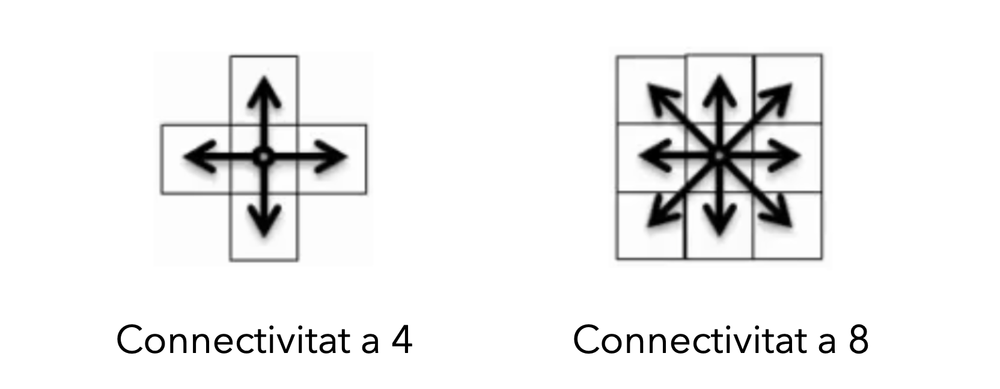
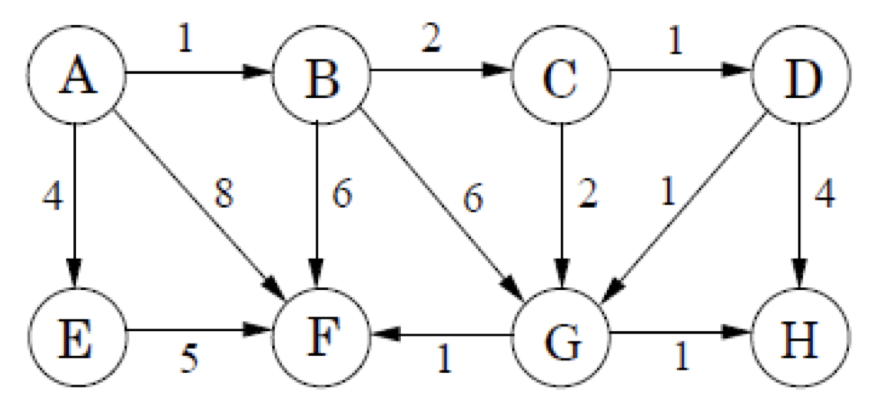
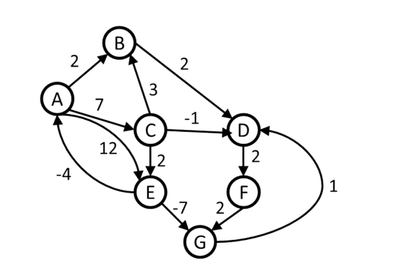
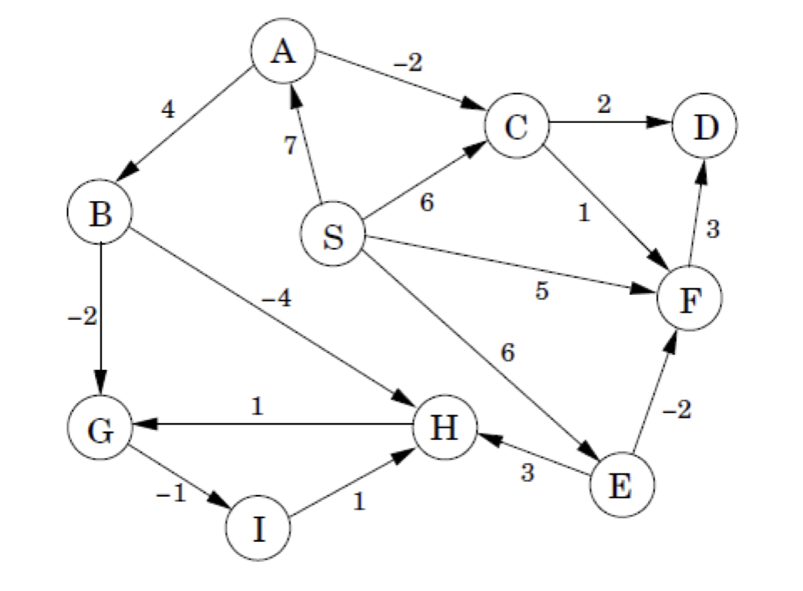

# Sessió en línia del dia 19/10/2020: Grafs II

Aquesta sessió té una durada aproximada de 60 minuts i està formada per alguns vídeos sobre els aspectes teòrics del tema i diversos exercicis. 
Es recomana seguir aquests continguts en el mateix ordre que apareixen en aquesta pàgina.

---
### Exercici 1: repàs sessió anterior

L’algorisme **Flood Fill** ens permet determinar l'àrea connectada a un node donada una matriu multidimensional. Una imatge de NxM píxels pot ser representada com un graf de NxM nodes on cada pixel és un node del graf. Dos nodes estan connectats mitjançant una aresta si aquests són adjacents. Podem tindre connectivitat a 4 (horitzontal i vertical) o connectivitat a 8 (horitzontal, vertical i diagonals). 

Donat un node d’inici, l’algoritme pintarà tot el segment de la imatge del mateix color del píxel seleccionat amb un color diferent donat.

Exemple: 
Solució de l'algoritme amb connectivitat a 4

Solució de l'algoritme amb connectivitat a 8

Trobeu el pseudocodi de l’algoritme. Aquest algorítme té moltes possibles solucions, us demanem una solució mitjançant el **mètode DFS**

---

### Vídeo: Dijkstra

Vídeo de 25' sobre l'algoritme Dijkstra.

<iframe width="560" height="315" src="https://www.youtube.com/embed/pSqmAO-m7Lk" frameborder="0" allow="accelerometer; autoplay; encrypted-media; gyroscope; picture-in-picture" allowfullscreen></iframe>

---

### Exercici 2: Dijkstra
Donat el següent graf

Començant al node A:
+ Dibuixa la taula de distàncies immediates a tots el node per a cada iteració del mètode.
+ Mostra l'arbre de camins mínims

### Exercici 3: Dijkstra 

Encara que el graf té arestes amb cost negatiu, executa l'algoritme de Dijkstra per tal de calcular els suposats camins més curts des de A a tota la resta de nodes. Mostreu els passos a la taula següent. Llisteu també els vèrtexs en l'ordre que els heu marcat coneguts.

| Vèrtex | Visitat | Distància | Camí | 
|--------------|---------------|---------------|---------------------------|
| A          |      |||
| B          |               |||
| C          |               |||
| D          |               |||
| E          |               |||
| F          |               |||
| G          |               |||

Indiqueu l'ordre com han estat visitats els nodes:

* Nodes visitats (amb ordre):      -      -      -      -      -      -      -      -

---
### Vídeo: Bellman Ford Algorithm

Vídeo de 15' sobre la representació dels grafs.

<iframe width="560" height="315" src="https://www.youtube.com/embed/lyw4FaxrwHg" frameborder="0" allow="accelerometer; autoplay; encrypted-media; gyroscope; picture-in-picture" allowfullscreen></iframe>

---

### Exercicis 4: Bellman Ford
Donat el següent graf

Començant al node A:
+ Dibuixa la taula de distàncies immediates a tots el node per a cada iteració del mètode.
+ Mostra l'arbre de camins mínims

---
### Vídeo: Topological Order.

Vídeo de 13' sobre l'agoritme DFS

<iframe width="560" height="315" src="https://www.youtube.com/embed/cIBFEhD77b4" frameborder="0" allow="accelerometer; autoplay; encrypted-media; gyroscope; picture-in-picture" allowfullscreen></iframe>

 
---

### Exercicis 5: Topological Order

Donat un gràfic dirigit i acíclic que té N vèrtexs i M arestes, imprimiu l'ordenació topològica dels vèrtexs.
+ Implementeu un algoritme per trobar l'ordre topològic utilitzant el mètode DFS (en el vídeo anterior se us explica el mètode de Kahn, però aquí demanem una implementació utilitzant el mètode DFS). 
+ Quina complexitat té l'algoritme?

**Entrada**
+ La primera línia consta de dos enters separats per espais que denoten N i M.
+ Cadascuna de les següents M línies consisteix en dos enters separats per espais X i Y que indiquen l'existència d'una aresta dirigida de X cap a Y.

**Sortida**
+ Imprimiu nombres enters separats per espais que denoten el tipus topològic, si hi ha diverses ordres, imprimiu el més petit lexicogràficament (podeu utilitzar una funció python per ordenar-los).

| SAMPLE INPUT | OUTPUT SAMPLE |
|--------------|---------------|
| 5 6          | 1 2 3 4 5     |
| 1 2          |               |
| 1 3          |               |
| 2 3          |               |
| 2 4          |               |
| 3 4          |               |
| 3 5          |               |

---
