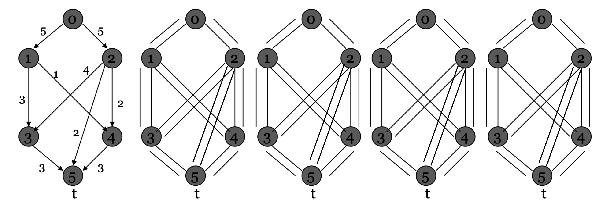
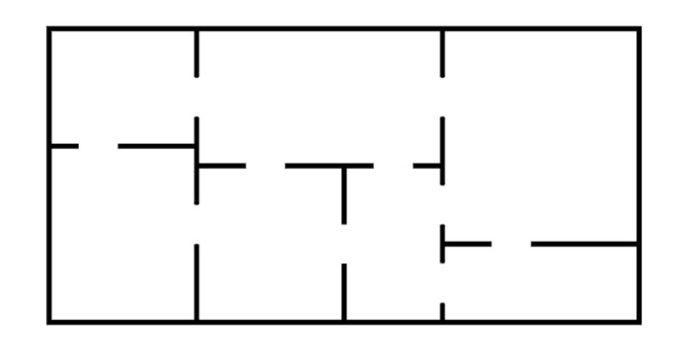

# Sessió en línia del dia 26/10/2020: Grafs I

Aquesta sessió té una durada aproximada de 60 minuts i està formada per alguns vídeos sobre els aspectes teòrics del tema i diversos exercicis. 
Es recomana seguir aquests continguts en el mateix ordre que apareixen en aquesta pàgina.

## El flux màxim (Max Flow)
---
En optimització i teoria de grafs, el problema de flux màxim serveix per trobar la quantitat màxima de flux que pot passar per una xarxa de flux, des d'una sola font (s) fins a un sol pou (t). El problema per tant es defineix com un graf dirigit on tenim un node inicial (s) i un node objectiu (t) amb l'objectiu de passar el màxim flux possible.

   <figure>
   
 <figcaption>Una xarxa de flux, amb font s i un pou t. Els números al costat de les arestes són les capacitats. El flux màxim de l'exemple és 15.</figcaption>
</figure>

 

Els principals algoritmes per resoldre aquest problema són l'algorisme de Ford-Fulkerson i l'algorisme de Dinic. En el següent vídeo podem veure el funcionament de l'algoritme de Ford-Fulkersen.

---
### Vídeo: Max-Flow 

L'algorisme de Ford-Fulkerson és un algorisme que calcula el **flux màxim** en una xarxa de flux. L'algorisme proposa buscar camins en els quals es pugui augmentar el flux, fins que s'aconsegueixi el flux màxim. La idea és trobar una ruta de penetració amb un flux positiu net que uneixi els nodes origen i destinació. 

Vídeo de 15' sobre el problem del Flux Màxim i l'algoritme  Ford-Fuulkerson.

<iframe width="560" height="315" src="https://www.youtube.com/embed/LdOnanfc5TM" frameborder="0" allow="accelerometer; autoplay; encrypted-media; gyroscope; picture-in-picture" allowfullscreen></iframe>

 

---
## Flux màxim tall mínim (Max-Flow - MinCut)

El teorema de flux màxim tall mínim postula que en una xarxa de flux, la quantitat màxima de flux que pot passar d'una font fins a un pou és igual a la capacitat mínima que necessitem treure-li a la xarxa perquè no pugui passar més flux de la font al pou.

Amb l'algorítme Ford-Fulkerson obtenim una capacitat de tall mínima. La pregunta és: Com s’imprimeixen totes les arestes que formen el tall mínim? La idea és utilitzar gràfics residuals.

A continuació es detallen els passos per imprimir totes les arestes del tall mínim.

1. Executeu l'algorisme Ford-Fulkerson i tingueu en compte el graf residual final.
2. Cerqueu el conjunt de vèrtexs accessibles des del graf residual final.
3. Totes les arestes que van des d’un vèrtex accessible fins a un vèrtex no accessible són les arestes del tall mínim. Imprimiu totes aquestes arestes.
---

### Exercicis: Max-Flow Ford Fulkersen

Aplica Ford-Fulkerson al següent graf e identifica min-cut y max-flow. 
Detalla els passos seguits a cada iteració.

<figure>
   
</figure>
 

---

## Camí Eulerià
- Un **camí Eulerià** és aquell camí que recorre tots els vèrtexs d'un graf passant una i només una vegada per cada aresta del graf.

- Un **circuit Eulerià** és aquell camí eulerià que comença i acaba en el mateix node.

---
### Vídeo: Camins i Circuits Eulerians
Vídeo de 9' sobre els camins eulerians.

<iframe width="560" height="315" src="https://www.youtube.com/embed/xR4sGgwtR2I" frameborder="0" allow="accelerometer; autoplay; clipboard-write; encrypted-media; gyroscope; picture-in-picture" allowfullscreen></iframe>

 
Vídeo de 15' sobre els algoritmes per trobar camins i circuits eulerians.

<iframe width="560" height="315" src="https://www.youtube.com/embed/8MpoO2zA2l4" frameborder="0" allow="accelerometer; autoplay; clipboard-write; encrypted-media; gyroscope; picture-in-picture" allowfullscreen></iframe>

---

### Exercicis: Camí Eulerià

Donada la següent planta d'un pis:

   <figure>
   
</figure>

1. Volem fer un recorregut per on es passi per totes les portes exactament una vegada. Existeix aquest recorregut? si és així, a quines habitacions ha de començar i finalitzar el recorregut? Quin és el recorregut?

2. És possible recórrer la casa visitant cada habitació exactament una vegada (no necessàriament utilitzant totes les portes)? Explica la solució i el recorregut en cas que existèixi.

