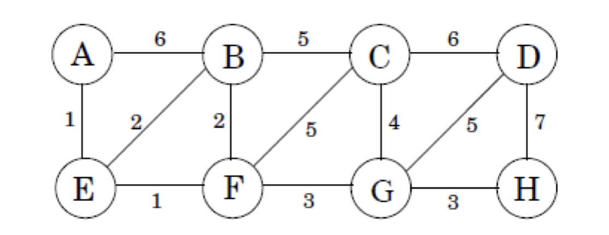

# Sessió en línia del dia 2/11/2020: Algoritmes Greedy (Voraç)

Greedy és un paradigma algorítmic que crea una solució pas per pas, escollint en cada pas l'acció que ofereixi el benefici més evident i immediat. Per tant, aquells problemes que millor s'adapten al paradigma greedy són aquell que escollir l'òptim localment condueixen a una solució global.

---

### Exercicis: Problema del canvi de monedes

El problema de canvi de monedes aborda la forma de trobar el nombre mínim de monedes tals que entre elles sumen una certa quantitat. 

* Escriu un algoritme greedy que donat una quantitat de diners (en Euros), retorni el mínim nombre de monedes (1c, 2c, 5c, 10c, 20c, 50c, 1€, 2€) que sumi aquesta quantitat. Podem assegurar que la solució és òptima? justifica la resposta.

* Ens trobem en un país estranger on les monedes disponibles són d'1, 3 i 4 unitats. Proveu el vostre algoritme. Podem assegurar que la solució és òptima? justifica la resposta.

---

### Exercici: Problema del repostatge de vehicles. 
Hem de fer un trajecte des d'un punt d'origen S i un destí D. El dipòsit del cotxe permet recórrer un màxim de K quilòmetres. Es demana trobar el nombre mínim de parades per a fer provisió de carburant durant el trajecte.

Implementeu un algoritme on:

Entrada: 
*  la distància màxima que pot recórrer un cotxe amb un tanc ple: K km; 
* una matriu sencera, [0, x_1, x_2, ..., x_n, x_n + 1], cada enter representa la distància entre una ubicació i un punt d'origen S. El primer enter és 0, que és la distància entre S i S. La segona distància x_1, representa la distància entre la primera benzinera i S. Hi ha n gasolineres entre S i D (la destinació). x_n és la distància entre l'última benzinera i S, i $x_n + 1$ és la distància entre D i S. 
* n, que és el nombre de benzineres.

Sortida: 
* Número mínim de parades de respotatge en el trajecte de S a D.

---

### És dijkstra un algoritme Greddy?
Justifica la resposta

---

### Exercici: Solució Greedy pel problema de la motxilla.

El problema de la motxilla consisteix d'un problema d'optimització combinatòria. Modelitza una situació anàloga al fet d'omplir una motxilla, en la que no es pot posar més d'un cert pes, amb tot o una part d'un conjunt d'objectes. Aquests objectes tenen un pes i un valor determinat. Els objectes que es posen dins la motxilla han de maximitzar el valor total sense sobrepassar el pes màxim.

   <figure>
   
</figure>

 

Penseu una soluió on greedy per aquest problema. En cada iteració s'ha d'escollir quin element introduïr i mai podem tornar endarrera.

---

## Minimum Spanning Tree

---
### Vídeo: Union Find 

<iframe width="560" height="315" src="https://www.youtube.com/embed/ibjEGG7ylHk" frameborder="0" allow="accelerometer; autoplay; clipboard-write; encrypted-media; gyroscope; picture-in-picture" allowfullscreen></iframe>

---

### Vídeo: Kruskal Algorithm

<iframe width="560" height="315" src="https://www.youtube.com/embed/JZBQLXgSGfs" frameborder="0" allow="accelerometer; autoplay; clipboard-write; encrypted-media; gyroscope; picture-in-picture" allowfullscreen></iframe>

 
 ---

### Exercici: MST i Kruskal.

Donat el següent graf:

   <figure>
   
</figure>

 

* Quin és el cost del MST?
* En quin ordre les arestes són incloses en el MST utilitzant l'algorisme Kruskal?

