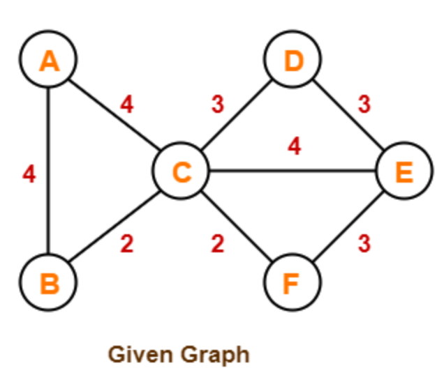

# Sessió en línia del dia 9/11/2020: Algoritmes Greedy 2(Voraç)

Greedy és un paradigma algorítmic que crea una solució pas per pas, escollint en cada pas l'acció que ofereixi el benefici més evident i immediat. Per tant, aquells problemes que millor s'adapten al paradigma greedy són aquell que escollir l'òptim localment condueixen a una solució global.

---
### Prim's Algorithm

<iframe width="560" height="315" src="https://www.youtube.com/embed/jsmMtJpPnhU" frameborder="0" allow="accelerometer; autoplay; clipboard-write; encrypted-media; gyroscope; picture-in-picture" allowfullscreen></iframe>

---
### Exercici: Trobeu el MST
Donat el següent graf, escolliu el mètode més òptim (Kruskal o Prim) per trobar la solució. Justifiqueu la solució i trobeu la solució.

   <figure>
   
</figure>

 

--- 
### Exercici: Prim vs. Kruskal
Quin algoritme corresponen a cada afirmació?

|                                                                                                                      | Prim or Kruskal? |
|----------------------------------------------------------------------------------------------------------------------|------------------|
| L’arbre que estem creant sempre roman connectat.                                                    |                  |
| L'arbre que estem  creant pot usualment estar desconnectat                                                            |                  |
| L’algorisme fa créixer una solució a partir d’un vèrtex aleatori afegint el següent vèrtex més barat a l’arbre existent.         |                  |
| És més ràpid per a grafs sparse                                                                                         |                  |
| És més ràpid per a grafs densos                                                                                        |                  |

---
### Graph coloring

La coloració de gràfics és àmpliament utilitzada. Malauradament, no hi ha cap algorisme eficient per pintar un gràfic amb un nombre mínim de colors, ens trobem enfront d'un conegut problema NP Complete. Hi ha algorismes aproximats per resoldre el problema. A continuació es mostra l’algorisme bàsic Greedy per assignar colors. No garanteix l'ús de colors mínims, però garanteix un límit superior en el nombre de colors. L’algorisme bàsic mai utilitza més de d + 1 colors on d és el grau màxim d’un vèrtex en el gràfic donat.

Algoritme bàsic de coloració greedy:

1. Pintem el primer vèrtex amb el primer color.
2. Per a la resta de vèrtexs V-1.
+ Considerem en el vèrtex seleccionat i el pintem amb el
color amb l'identificador més baix que no hagi estat utilitzant en els vèrtexs adjacents. Si tots els colors disponibles fins aleshores han estat utilitzats, li assignem un color nou.

---

### Huffmann Code.
El codi Huffman és un algorisme de compressió de dades que utilitza la tècnica greedy per a la seva implementació. L’algorisme es basa en la freqüència dels caràcters que apareixen en un fitxer. Podeu trobar una explicació detallada a la següent pàgina:

https://www.codesdope.com/course/algorithms-huffman-codes

Implementeu la vostra versió de l'algoritme. 
